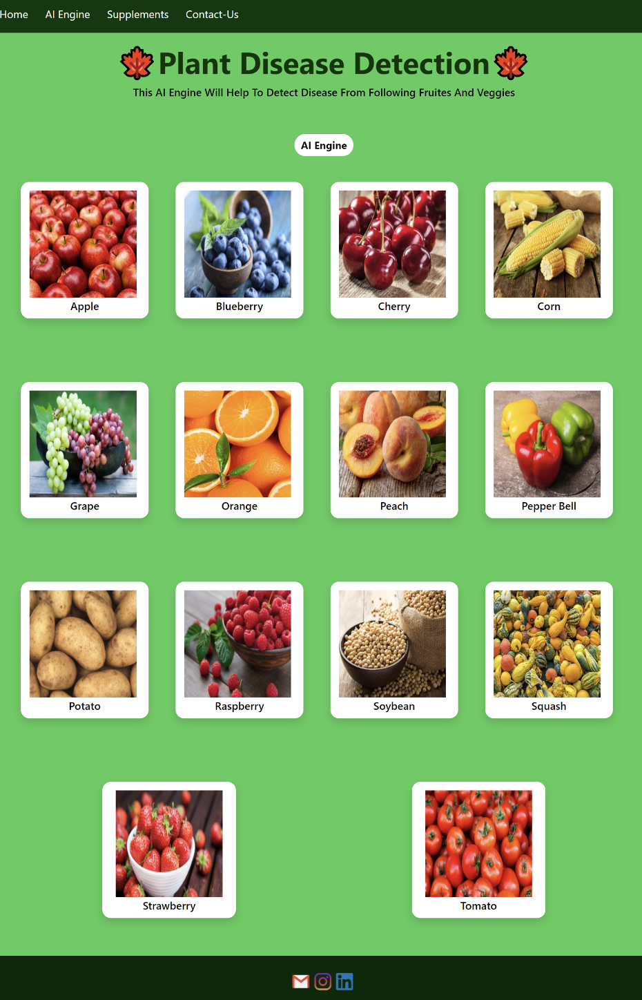
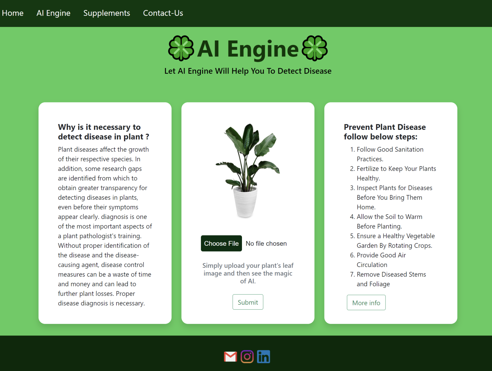
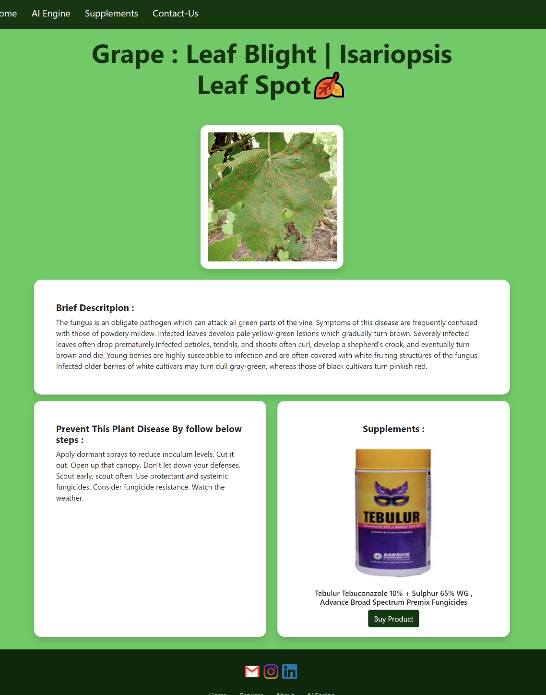

# ⭐Plant-Disease-Detection
* Plant Disease is necessary for every farmer so we are created Plant disease detection using Deep learning. In which we are using convolutional Neural Network for classifying Leaf images into 39 Different Categories. The Convolutional Neural Code build in Pytorch Framework. 

## ⭐Testing Images

* If you do not have leaf images then you can use test images located in test_images folder
* Each Image have it's disease name so you can verify model is working perfact or not.

## ⭐Snippet of Web App :
#### Main page
  
#### AI Engine 
  
#### Results Page 
  
#### Supplements/Fertilizer  Store
  
#### Contact Us 
   
